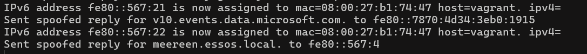
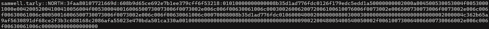
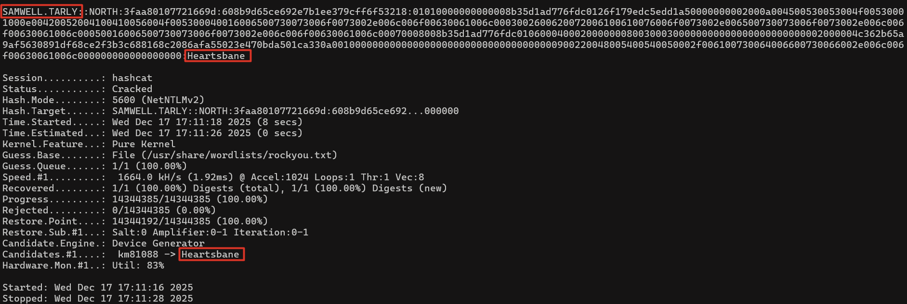

---

title : 'DHCPv6 Poisoning: An Overlooked Weakness in Windows Networks'
date : '2025-12-26'
tags: ["windows", "security", "active-directory", "pentesting"]
draft: false
cover:
  image: "Cover.png"
  relative: true
  hiddenInSingle: false
  responsiveImages: false

---

Windows networks often operate primarily on IPv4, yet IPv6 remains enabled and active on nearly all Windows systems by default. Even in environments where IPv6 is not intentionally deployed, Windows continues to search for configuration sources that provide IPv6 parameters. This behaviour introduces an attack surface that is frequently underestimated: DHCPv6 poisoning.

This technique has been known in the security community for years and continues to appear in modern assessments. Evidence collected for this blog uses mitm6 to demonstrate how easily Windows clients can be influenced when IPv6 behaviour is not monitored or controlled.

## **How DHCPv6 poisoning works**

In many enterprise environments no official DHCPv6 infrastructure is present. Windows clients therefore rely on automatic IPv6 configuration and remain receptive to any DHCPv6 responder on the network. Since the protocol does not enforce authentication in typical deployments, a malicious system can supply:

* A rogue IPv6 DNS server
* A manipulated DNS suffix
* IPv6 routes that divert traffic

The client silently accepts this configuration and immediately begins using the supplied DNS and routing information. The change occurs automatically, without user interaction and without visible warnings.

## **Observed behaviour during analysis**

In the evidence below, mitm6 is being used to illustrate how Windows clients begin sending DNS and authentication related traffic to the supplied IPv6 addresses after receiving poisoned DHCPv6 information. Even in networks that depend exclusively on IPv4, IPv6 remains active enough to influence critical name resolution and connection behaviour.

The effect is immediate: system processes enhance the level of interaction with the injected IPv6 DNS server, creating opportunities for traffic redirection and protocol level manipulation. This demonstrates that DHCPv6 poisoning serves as an effective foundation for broader interception techniques.

## **Impact on intercepted authentication traffic**

DHCPv6 poisoning does more than redirect name resolution. Once a client adopts attacker supplied IPv6 configuration, authentication flows that rely on NTLM become exposed. This includes NetNTLMv2 and, in certain legacy environments, NetNTLMv1 or related challenge response exchanges. These authentication pairs do not reveal plaintext credentials, yet they can be used in offline password brute forcing attempts, since domain lockout policies do not apply to offline verification.

The exposure of these challenge response samples demonstrates that DHCPv6 poisoning is not limited to traffic manipulation but also introduces a credential security risk. Weak or reused passwords become significantly more vulnerable under these conditions.

The image below shows a NetNTLMv2 challenge response pair captured after the poisoned IPv6 configuration redirected authentication traffic. Such intercepted NetNTLMv2 samples can subsequently be subjected to offline password-guessing techniques, for example with dedicated cracking tools such as Hashcat, since domain lockout policies do not apply outside the authentication infrastructure.

The final screenshot illustrates an offline password-cracking attempt performed on the intercepted NetNTLMv2 sample using Hashcat. The password was recovered in a short amount of time, demonstrating how weak or reused credentials can be compromised once a challenge-response pair has been obtained. With a successfully cracked password, an attacker would be able to authenticate as the affected user within Active Directory, highlighting the broader security impact that originates from DHCPv6 poisoning.

## **Why DHCPv6 poisoning matters**

The strength of this attack lies in its simplicity and its largely invisible nature. It requires no privileged position between the client and legitimate servers, often causes no disruption to existing services and in most cases produces little to no visible impact on the user's workflow. The Windows networking stack accepts the malicious configuration and proceeds to use it as though it were legitimate.

DHCPv6 poisoning is therefore a foundational technique. It enables the conditions required for other well known exploitation paths such as SMB relaying, LDAP or LDAPS relaying and certificate based escalation through ADCS. These follow-up scenarios will be examined in a future blog, as the focus here remains on the poisoning mechanism itself.

## **Environmental factors that contribute to exploitation**

Several characteristics of typical Windows networks make DHCPv6 poisoning consistently viable:

* IPv6 is enabled by default, even when unused
* DHCPv6 is often not configured or monitored
* Windows automatically trusts IPv6 configuration sources
* No authentication exists for standard DHCPv6 traffic

This combination allows an attacker to influence client behaviour without elevated access and without the need for deep network placement.

## **Mitigation strategies**

Reducing or eliminating the risks associated with DHCPv6 poisoning involves a combination of network level and host level measures.

**Disable IPv6 when operationally unnecessary**

If IPv6 is not part of the organisation’s network architecture, it can be disabled under controlled conditions. This prevents Windows clients from requesting or accepting IPv6 configuration.

**DHCPv6 Guard and DHCPv6 Snooping on network switches**

Many enterprise switches support DHCPv6 Guard or DHCPv6 Snooping.

These features differentiate between trusted and untrusted ports and inspect DHCPv6 traffic at the switch level. Rogue DHCPv6 responses originating from untrusted interfaces are blocked before reaching clients. This creates a strong enforcement boundary that prevents malicious configuration from entering the network.

**Monitor for unsolicited IPv6 activity**

Alerts triggered by unexpected DHCPv6 advertisements, rogue IPv6 DNS servers or abnormal IPv6 traffic can reveal poisoning attempts at an early stage.

**Protocol hardening for later attack stages**

Controls such as SMB signing, LDAP signing, channel binding and ADCS hardening significantly reduce the impact of any authentication traffic that becomes exposed as a result of DHCPv6 poisoning. These measures will be discussed in detail in the upcoming follow up blog focused on relay techniques.

## **Conclusion**

DHCPv6 poisoning highlights how default IPv6 behaviour in Windows environments can be leveraged to redirect key network flows and expose authentication data, even in networks that rely almost entirely on IPv4. The technique remains effective because of unauthenticated IPv6 configuration, lack of DHCPv6 infrastructure and the silent nature of Windows’ acceptance of IPv6 parameters.

While this blog concentrates on the poisoning mechanism and its direct consequences, the broader implications become apparent when the intercepted traffic is combined with NTLM based relaying toward services such as SMB, LDAP, LDAPS or ADCS. These scenarios will be examined in a future post to provide a complete picture of how a simple IPv6 configuration weakness can escalate into more extensive compromise paths.