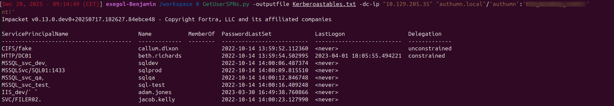
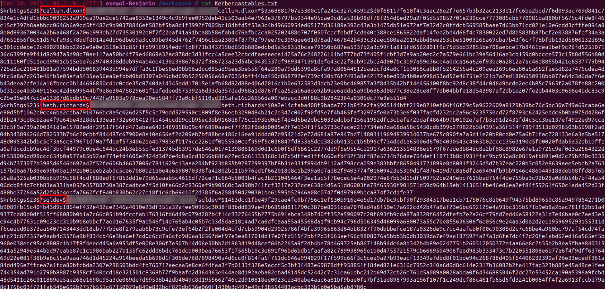
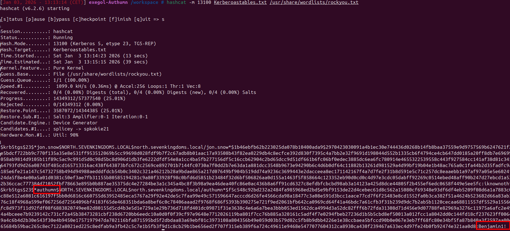

---

title : 'Kerberoasting: How Service Accounts Become a Silent Credential Exposure Risk'
date : '2025-12-28'
tags: ["windows", "security", "active directory", "kerberos"]
cover:
  image: "cover.png"
  relative: true
  hiddenInSingle: true
  responsiveImages: false

---

Kerberos is the primary authentication mechanism in Active Directory environments and is designed to provide secure, ticket-based authentication between users, services and domain controllers. While Kerberos itself is a strong protocol, its security depends heavily on how service accounts are configured. One commonly overlooked weakness is Kerberoasting, a technique that allows attackers to extract service ticket hashes and perform offline password attacks against service accounts.

Kerberoasting does not exploit a vulnerability in Kerberos. Instead, it abuses legitimate protocol behaviour combined with weak or mismanaged service account credentials. This makes the technique particularly dangerous, as it often remains undetected and does not require elevated privileges.

## **How Kerberoasting works**

Kerberoasting abuses the way Kerberos handles authentication for services that run under domain accounts. In Active Directory, services that use Kerberos authentication are associated with a Service Principal Name, or SPN. This SPN links a specific service instance to a user or computer account and allows clients to request a Kerberos service ticket when they need to access that service.

When a domain user requests access to a Kerberos-enabled service, the domain controller issues a service ticket known as a Ticket Granting Service ticket. This ticket is encrypted using a key derived from the password of the service account that owns the SPN. The encryption ensures that only the intended service can decrypt and use the ticket.

The critical aspect is that any authenticated domain user is allowed to request service tickets for any SPN in the domain. This behaviour is by design and required for Kerberos to function correctly. However, it also means that a user does not need elevated privileges to obtain tickets for services they are not authorised to access.

Although the service ticket does not contain the service account password in plaintext, it contains cryptographic material that is directly tied to that password. Once a ticket has been obtained, it can be extracted and analysed offline. Because this analysis happens outside the Active Directory environment, it is not subject to account lockout policies, rate limiting or real-time detection controls.

If the service account password is weak then the encrypted portion of the ticket can be used to recover the original password through offline guessing techniques.

Kerberoasting therefore transforms service accounts into passive credential exposure points. The attack does not require exploitation of a vulnerability, interaction with the service itself or modification of directory objects. It relies entirely on legitimate Kerberos functionality combined with insufficient service account hygiene.

## **Observed behaviour during analysis**

The evidence below demonstrates the enumeration of all accounts within the domain that have one or more Service Principal Names configured. Service ticket requests were issued for these accounts, and the domain controller responded as expected by returning Kerberos service tickets for each associated service account. This behaviour is part of normal Kerberos operation and does not, by default, generate warnings or errors.

The returned tickets contain encrypted data derived from the passwords of the corresponding service accounts. Although the tickets do not expose plaintext credentials, they include cryptographic material that can be analysed offline. This process requires no interaction with the services themselves and does not involve any modification of directory objects.

The screenshot below shows how SPN-enabled accounts can be enumerated and how their associated service tickets can be retrieved using the GetUserSPNs functionality from the Impacket toolkit.

Once the service tickets have been obtained, the encrypted ticket data can be extracted for further offline analysis. The following screenshot illustrates the extracted hashes derived from the captured service tickets.

These observations highlight that Kerberoasting activity blends seamlessly into legitimate domain behaviour. Service ticket requests are indistinguishable from normal Kerberos operations, making detection difficult without focused monitoring or anomaly-based analysis.

## **Impact of extracted service ticket hashes**

Once a service ticket hash has been obtained, it can be processed offline. Since this activity takes place entirely outside the Active Directory environment, account lockout policies, rate limiting and most monitoring controls do not apply. The likelihood of recovering the original password depends primarily on its complexity, reuse and how long it has remained unchanged.

The screenshot below demonstrates that a weak service account password can be recovered in a short amount of time once the corresponding service ticket hash has been extracted.

A compromised service account can have a significant impact on the environment. Service accounts often run critical applications, scheduled tasks or backend services and are frequently granted elevated privileges to function correctly. In practice, these privileges are often broader than necessary. In some environments, service accounts are members of highly privileged groups or even assigned Domain Administrator rights, dramatically increasing the blast radius of a successful Kerberoasting attack.

This combination of offline password exposure and excessive privileges makes poorly managed service accounts a high-value target within Active Directory environments.

## **Service Principal Names as the root cause**

Kerberoasting is only possible when a service account has an SPN assigned. SPNs bind a service instance to an account and enable Kerberos authentication for that service.

The screenshot below shows the configration of a service account with an SPN configured, making it eligible for Kerberos service ticket requests.

While SPNs are required for Kerberos to function correctly, they also define the attack surface for Kerberoasting. Poorly managed SPNs combined with weak passwords create a predictable exposure point.

## **Why Kerberoasting is difficult to detect**

Kerberoasting uses legitimate Kerberos functionality. Ticket requests are normal domain operations and do not generate obvious security alerts. The offline password recovery phase happens entirely outside the domain and leaves no trace in authentication logs.

Several factors contribute to its effectiveness:

- Any authenticated domain user can request service tickets
- No interaction with the service itself is required
- Offline cracking bypasses domain protections
- Service account passwords often remain unchanged for long periods.

As a result, Kerberoasting frequently remains unnoticed until after service accounts have already been compromised.

## **Mitigation strategies**

Reducing the risk of Kerberoasting does not require changes to the Kerberos protocol itself. Instead, effective mitigation focuses on improving service account hygiene and enforcing stricter identity management practices.

**Use strong, long and unique service account passwords**

Service accounts should be configured with passwords that are resistant to offline password guessing attacks. Weak, reused or predictable passwords significantly increase the likelihood of successful Kerberoasting once a service ticket hash has been extracted.

**Prefer managed service accounts**

Group Managed Service Accounts (gMSA) provide a robust solution by automatically generating and rotating strong passwords. By eliminating static credentials altogether, gMSAs effectively neutralise the primary weakness exploited by Kerberoasting.

**Limit service account privileges**

Service accounts should strictly adhere to the principle of least privilege. Only the permissions required for the service to function should be granted. Unnecessary domain-level or administrative rights significantly increase the impact of a compromised service account and should be avoided.

**Monitor service ticket request patterns**

Kerberoasting activity may appear as an unusual number of service ticket requests within a short time frame. Monitoring for abnormal Kerberos service ticket activity can help identify potential abuse and trigger further investigation.

**Audit and manage SPN assignments**

Service Principal Names should be reviewed regularly to ensure they are still required and correctly assigned. Removing unused or unnecessary SPNs reduces the number of accounts exposed to Kerberoasting and limits the overall attack surface.

## **Conclusion**

Kerberoasting shows a risk that exists in many Active Directory environments, not because Kerberos or Service Principal Names are insecure by design, but because service accounts are often poorly managed. SPNs are a normal and required part of Kerberos authentication and are needed for many services to operate correctly. This article does not suggest that SPNs should be removed.

The problem starts when SPNs are combined with weak, static or rarely changed service account passwords. In that situation, normal Kerberos behaviour can be abused to extract service ticket data and perform offline password cracking. This activity does not generate errors, does not require interaction with the service itself and is difficult to detect, as it looks like regular domain traffic.

The evidence in this article shows how quickly weak service account passwords can be recovered once a service ticket hash has been obtained. When these service accounts also have excessive privileges, the impact increases significantly and can, in some cases, lead to full domain compromise.

The goal of this article is to increase awareness of the risks associated with weak configured service account passwords. Kerberoasting is not about misusing SPNs, but about understanding how weak credentials turn a necessary feature into a security issue. By using strong passwords, limiting privileges and adopting managed service accounts, organisations can use Kerberos safely while greatly reducing the risk of Kerberoasting.