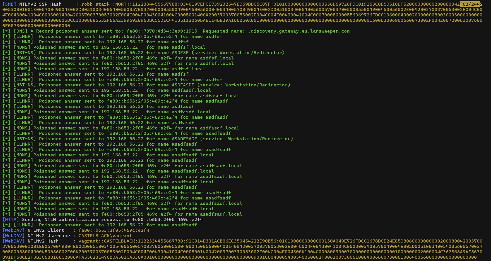
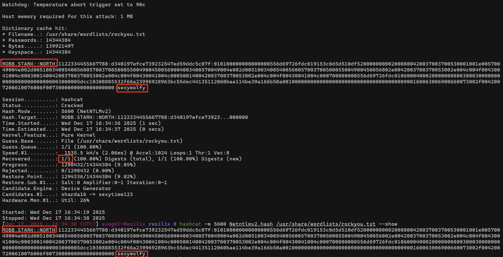

---

title : 'LLMNR, NBT-NS and mDNS: Legacy Name Resolution Protocols That Open the Door to Credential Exposure'
date : '2025-12-26'
tags: ["windows", "security", "active-directory", "pentesting"]
draft: false
cover:
  image: "DnsPosioningLogo.png"
  relative: true
  hiddenInSingle: true
  responsiveImages: false

---

Windows environments rely on several name resolution mechanisms to locate resources when DNS queries fail or when systems operate in mixed or unmanaged networks. Among these mechanisms are LLMNR (Link-Local Multicast Name Resolution), NBT-NS (NetBIOS Name Service) and mDNS (Multicast DNS). Although created to support small or misconfigured networks, these protocols continue to operate silently in many modern enterprise environments.

Their design introduces predictable weaknesses. All three protocols accept responses from any device on the local network segment. This behaviour creates conditions for credential interception when a system requests a name that cannot be resolved through DNS. For this reason, the protocols have long been associated with credential exposure and are frequently observed in security assessments.

## **How LLMNR, NBT-NS and mDNS function**

When a Windows system attempts to resolve a hostname and DNS fails to provide an answer, the operating system automatically falls back to additional name resolution methods.

**LLMNR:** LLMNR sends multicast queries to the local network segment when DNS resolution fails. Any system within that subnet can respond.

**NBT-NS:** NetBIOS Name Service is an even older fallback mechanism. It broadcasts name requests to the local network and accepts any matching reply.

**mDNS:** Multicast DNS is commonly used in mixed environments and service discovery scenarios. Like LLMNR, it relies on multicast traffic and trusts the first valid response.

These protocols were designed without authentication. As a result, any host on the same network segment can reply to a request, claiming authority over a requested resource.

## **Observed behaviour in Windows environments**

When LLMNR, NBT-NS or mDNS queries are broadcast, any system on the same network segment can impersonate the requested service. A malicious responder can reply to these requests and present itself as the hostname being searched for. Windows then initiates authentication to this rogue responder as part of its normal network behaviour.

The image below displays Responder.py providing spoofed responses to LLMNR, NBT-NS and mDNS queries. This screenshot illustrates how easily these legacy name resolution protocols can be influenced by an untrusted device on the same network segment.

## **Impact on intercepted credentials**

The fallback behaviour of LLMNR, NBT-NS and mDNS can cause systems to direct authentication attempts toward a rogue responder. In most environments this results in the interception of NetNTLMv2 challenge-response pairs, and in certain legacy configurations NetNTLMv1 or other related exchanges. These samples do not reveal plaintext credentials directly, but can be subjected to offline password guessing, making weak or reused passwords significantly more vulnerable.

In addition to NTLM-based authentication, certain environments may still produce unencrypted HTTP traffic during service discovery or when applications fall back to non-TLS endpoints. If such traffic carries basic or form-based authentication over plain HTTP, the associated credentials may be exposed in clear text. Although this behaviour is less common in modern deployments, it remains possible in networks where legacy systems, management interfaces or misconfigured internal applications still rely on unsecured HTTP communication.

The image below shows a NetNTLMv2 challenge-response pair captured after the system attempted to authenticate to the rogue responder. The example highlights the type of credential material that becomes exposed through these legacy name resolution mechanisms.

The final screenshot demonstrates an offline cracking attempt using Hashcat against the intercepted NetNTLMv2 sample. The recovered password indicates how quickly weak credentials can be compromised once a challenge-response pair is obtained, further highlighting the security implications of leaving these protocols enabled.

The combination of name resolution protocols and fallback to unsecured transport can therefore lead not only to the capture of challenge-response samples, but also, in specific scenarios, to the interception of plaintext credentials. This broadens the overall impact and further highlights the necessity of disabling or restricting these legacy mechanisms.

## **Why these protocols remain problematic**

The continued prevalence of LLMNR, NBT-NS and mDNS is due to a combination of default Windows settings, legacy application requirements and the persistence of mixed network environments. Their behaviour introduces several structural risks:

- Trust in unauthenticated responses
- Automatic fallback behaviour without warnings
- Network broadcast and multicast traffic visible to all hosts
- NTLM authentication attempts triggered without user awareness

Without additional safeguards, these protocols create predictable opportunities for credential interception and subsequent misuse.

## **Mitigation strategies**

Mitigation requires a combination of host configuration, network controls and credential hygiene.

**Disable LLMNR and NBT-NS where possible**

Group Policy provides settings to disable LLMNR.

NBT-NS can be disabled by turning off NetBIOS on the relevant interfaces.

These two controls significantly reduce legacy fallback behaviour.

**Restrict or monitor mDNS**

mDNS may be required for certain device types, but enterprise networks can segment or filter multicast traffic to prevent misuse.

**Deploy network-level detection**

Monitoring tools can detect rogue LLMNR, NBT-NS and mDNS responders, allowing rapid identification of suspicious behaviour.

## **Conclusion**

LLMNR, NBT-NS and mDNS exemplify legacy name resolution protocols that continue to influence modern Windows networks. Their design and silent fallback behaviour create opportunities for credential interception, often without visible signs on the client system.

Although these protocols were never intended to operate in hardened enterprise environments, they remain enabled by default and are therefore commonly exploited. Proper mitigation requires targeted configuration changes, improved credential practices and network-level enforcement.

A follow-up blog will cover how intercepted credentials from these protocols can be leveraged in broader attack chains, including NTLM relaying and privilege escalation pathways, similar to those observed in IPv6-based poisoning scenarios.