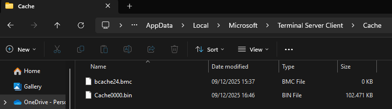
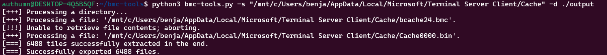
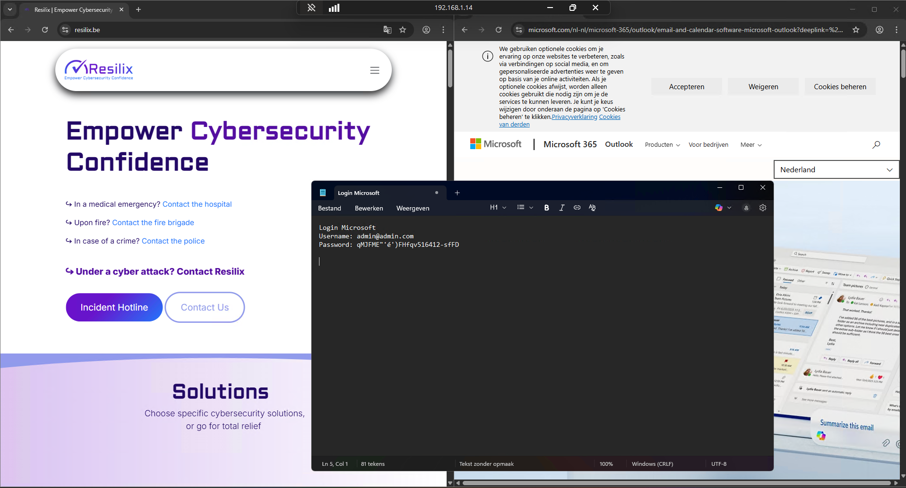
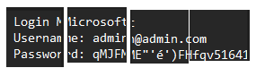
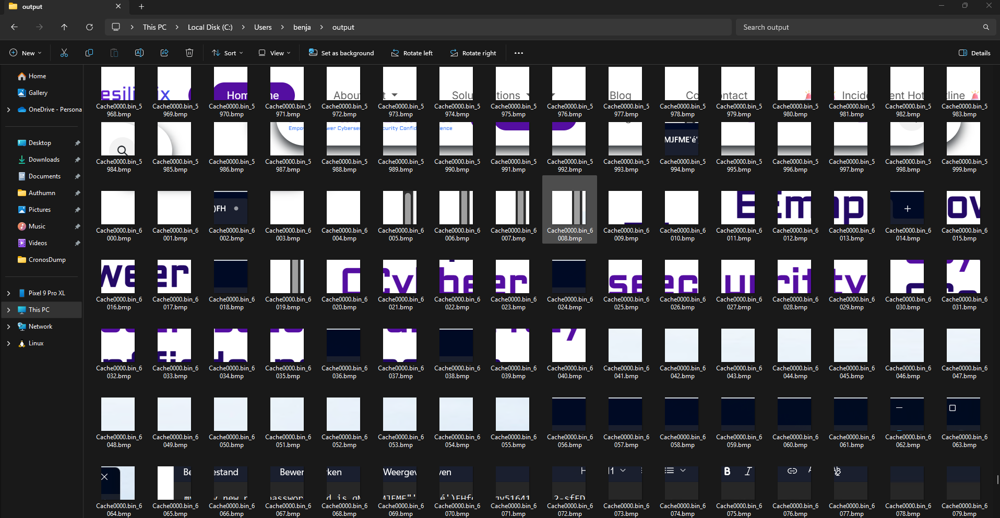

Remote Desktop has been a standard tool for system administrators and anyone who needs to manage a server or workstation from a distance for many years. During a session far more happens behind the scenes than most people realise. Windows quietly stores small fragments of the remote screen, a mechanism known as the RDP Bitmap Cache.

Many users assume that once an RDP session is closed, anything that appeared on the screen disappears as well. In reality a portion of that visual data remains on the local machine. Forensic investigators consider this a valuable source of information, and in security-focused environments it is important to understand what this cache contains, how it works and which risks it introduces.

This technique has been known in the security community for a long time. The process can be reproduced with publicly available tools, which demonstrates how much information can be recovered long after the remote session has ended.


## Background

### What is the RDP Bitmap Cache

During an RDP connection Windows divides the remote screen into many small square tiles. These tiles are then saved locally so that identical content can be shown again without being retransmitted. This increases performance and reduces bandwidth usage.

The optimisation comes with a side effect. The local system accumulates a collection of image fragments that represent parts of the remote session. These files are stored inside the user profile in the following folder:

```text
 %LocalAppData%\Microsoft\Terminal Server Client\Cache
```

This folder contains .bmc files and .bin files, each holding different segments of the cached screen tiles. The screenshot below illustrates this directory with both file types present.



## Exploiting this 'feature'
### Converting the cache files into readable images
The ANSSI BMC Tools project on GitHub provides functionality to parse .bmc and .bin files and convert the contained tiles into ordinary image files. After conversion the output directory contains a large number of tiny screenshots that represent fragments of the original session.

The screenshot below shows this process in action. Several of the exported tiles clearly reveal elements of websites that were open during the session, including microsoft.com and resilix.be. Even at a very small size the colours, layout and branding of these sites remain recognisable.



### What appeared when reconstructing the tiles
During the analysed session the remote desktop displayed browser windows containing the Microsoft and Resilix websites. A Notepad window with sample login information was also visible. A screenshot of the active RDP session was taken beforehand to show the original context.



Once the cache files were exported and viewed as tiles, multiple fragments were found that contained parts of the Notepad window. Several of these tiles included enough readable characters to reconstruct the redacted login text. A composite image was created to demonstrate how easily the information could be pieced together.



The following screenshots displays the output folder in File Explorer. When examining the exported tiles closely, many fragments reveal identifiable portions of the visited websites. Combined, these tiles form a surprisingly complete representation of activity within the remote session.




## Impact
### Why this matters for anyone who uses RDP

Nothing unusual is required for this data to appear. No malware, no exploit and no form of manipulation is involved. This is standard RDP behaviour that has existed for years. The cache was designed to improve performance, not to protect privacy or confidentiality. It quietly stores fragments of whatever happened to be shown on the screen.

If someone gains access to a laptop or user profile, they can extract and analyse the cache in the same way I did. The fact that open source tools make this process straightforward should make any organisation think carefully about how RDP is used and how local caching is managed.

### A small feature with unexpected consequences

This behaviour has been described by researchers for years. Reproducing it with modern tools shows how much information may remain available long after the remote session has ended. Understanding the nature of the stored data is essential for preventing unintended information exposure and for making informed decisions about the use of RDP in sensitive environments.

## Mitigation
### Mitigation options for controlling RDP bitmap caching
Although the RDP Bitmap Cache is a long standing performance feature, the associated data retention can be reduced or eliminated through several configuration changes. 

One commonly used method is disabling persistent bitmap caching in the Remote Desktop client settings. The screenshot below illustrates this option in the Experience tab of the standard mstsc interface. Clearing this checkbox prevents the client from storing tile data on the local system during future RDP sessions.


This approach limits the creation of new cache files, although any previously stored tiles remain until manually removed. It is a straightforward remediation step and can be applied on individual systems without additional infrastructure.

In environments that rely on centralised management, the same restriction can be enforced through Group Policy. Active Directory allows administrators to disable persistent bitmap caching for all domain joined machines by enabling the corresponding policy under the Remote Desktop Session Host configuration. This ensures consistent behaviour across the organisation and prevents local overrides.

## Conclusion
The RDP Bitmap Cache may seem like a minor technical detail, but in reality it can introduce significant and often overlooked security risks. Because Windows stores small fragments of the remote screen for performance reasons, sensitive visual information can remain accessible long after an RDP session has ended. As demonstrated above, even ordinary administrative sessions can leave behind enough data to reconstruct visited websites, documents, or even parts of login information.


For any organisation relying on RDP, it is essential to understand how this caching mechanism works, what data is retained, and which configuration options are available to reduce exposure. By disabling persistent caching, enforcing group policies, and reviewing how remote access is handled across the environment, you can drastically minimise the chance of unintended information leakage.